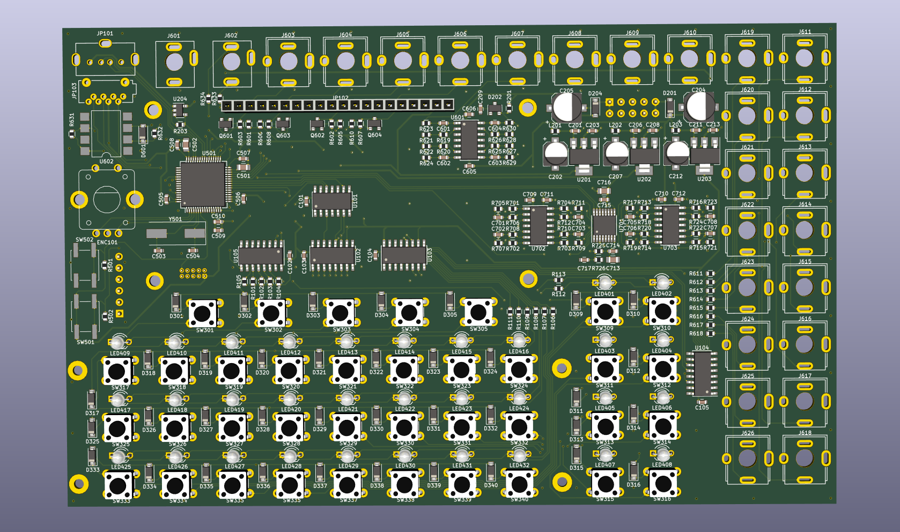
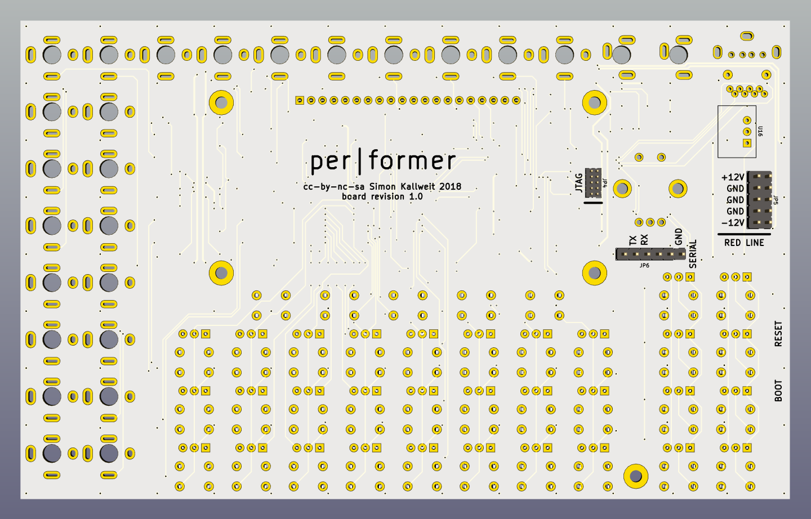
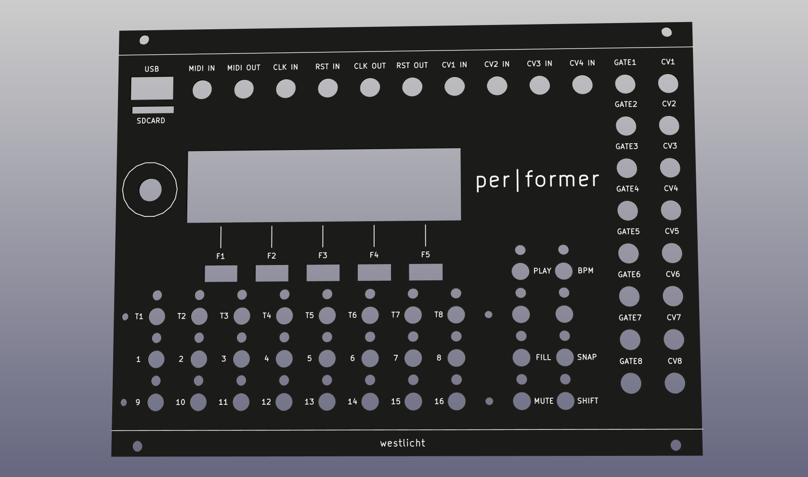

# PER|FORMER - Hardware Design Files

## Overview

This repository contains the hardware design files (KiCad) for the **PER|FORMER** eurorack sequencer.

For more information on the project go [here](https://westlicht.github.io/performer).

The firmware is hosted in a separate repository [here](https://github.com/westlicht/performer).

## Schematic

The schematic is available as a [PDF](https://cdn.rawgit.com/westlicht/performer-hardware/master/sequencer.pdf).

## Physical dimensions

| Board      | Width (mm) | Height (mm) |
| ---------- | ---------- | ----------- |
| PCB        | 171.45     | 106.68      |
| Frontpanel | 172.5      | 128.27      |

The width of the module is 34 HP in [eurorack standard](http://www.doepfer.de/a100_man/a100m_e.htm).

## Bill of materials

The BOM is available as a [CSV](bom/bom.csv) and [HTML](https://cdn.rawgit.com/westlicht/performer-hardware/master/bom/bom.html). In addition to the parts on the PCB there are a few additional hardware components that are necessary to complete the build, see [here](bom/hardware.csv).

## License

 

This work is licensed under a <a rel="license" href="http://creativecommons.org/licenses/by-nc-sa/4.0/">Creative Commons Attribution-NonCommercial-ShareAlike 4.0 International License</a>.

## Images

